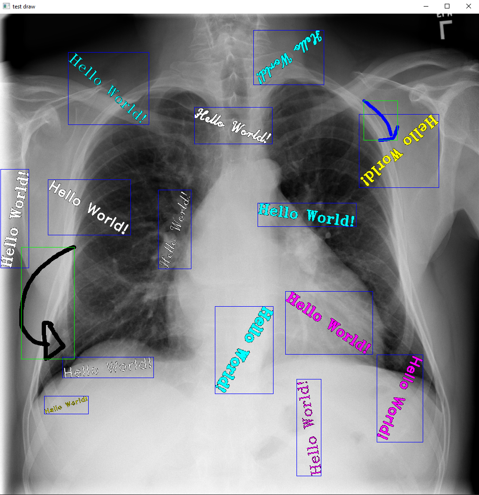

# Synthetic-Data
Automatic detection of patients' information and annotation on medical images

### Data Collection - Synthetic data
data_generator.py allow user to generate synthetic data to model ral-world data-sets and store ground truth data in 
appropriate format using **Open-CV** and **Numpy**\
press and drag mouse to draw a free-hand sketch\
press **S** to save data\
press **R** to randomized line size and color\
press **B** to show/hide bounding boxes\
press **SPACE** to capture bounding box of the last drawing\
